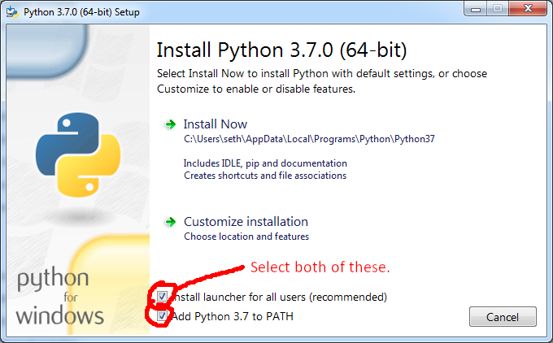

_Even old New York was once New Amsterdam..._

--Sultan Mehmed II of the Ottoman Empire

# Overview
**Not Constantinople** procedurally blends city and regional names using "recipes" of "cultures".

This is an example "recipe":

```json
{
    "culture": {
        "assyrian": 1,
        "georgian": 1,
        "alan": 1,
        "greek": 15,
        "roman": 8,
        "armenian": 8
    },
    "name": "pharostine"
}
```

This will generate a list  of blended place-names that are "1 part Assyrian, 1 part Georgian, 1 part Alan, 15 parts Greek, 8 parts Roman, and 8 parts Armenian":

```
Korchaldea
Achanopolis
Suenza
Theodike
Chenza
Kaia
Aleia
Ankyrrantia
Galerson
Kaion
Byzandax
Byzantiochion
Famalkidikos
Rhoneia
Edessina
Thev
Cephetrina
```

# About this README
This program and this README are intended for _non-programmers_. If you're a non-programmer, this all might appear a little intimidating. That's OK. I promise it looks tougher to use than it actually is. I'm going to walk you through installing and using the program. Have confidence in your own abilities! It'll be great!

# Installation

## 1. Install Python 3
Grab it [here](https://www.python.org/downloads/) (Click the big yellow button).

When installing, be sure to _Add Python to PATH_ (the checkbox at the very bottom).


### What is Python?
Python is a programming language. I made this software in Python. Python is a good tool for some things and not a good tool for other things. It's a _great_ tool for manipulating words.

I could _compile_ it into a .exe or .app, but I don't think it's worth it; for example, I don't own a Mac, so I would have no way to know if it actually works on OS X. If I just leave it as Python code, I can be sure it'll work for you.

## 2. Open up the terminal
In Windows, go to Start, click on the search dialogue, type in `powershell`, and press enter.

In OS X, go to finder, type in `terminal`, and press enter.

Congrats! You're in the Matrix. The terminal looks way scarier than it actually is.

### How to read terminal instructions
Whenever you read "type `some instructions`" that always means: type those instructions _in the terminal_ and then _press enter._

Whenever you read something like "type `cd <path/to/file>`" don't type the \< or the \>, and replace path/to/file with the actual path to the file (for example: `cd c:/users/seth/Not_Constantinople`)  

## 3. Install markovify

`markovify` is the Python module the program uses to generate gibberish. It's free and you get it by typing into the terminal:

```bash
pip3 install markovify
```

## 4. Download my program
Get it [here](https://github.com/subalterngames/Not_Constantinople/releases/tag/1.0). Unzip the download.

## 5. Congratulate yourself!
OK you're all set up. Great job!! I knew you could do it.  

# Usage

Using Windows Explorer (Windows) or Finder (OS X), navigate to `Not_Constantinople/Input` (I don't know where the folder ``Not_Constantinople` is located; it's wherever you unzipped the download .zip file.)

## Create your input file

The example I gave earlier is from the file `Not_Constantinople/Input/pharostine.json`. To make your own input file:

- Open Notepad (Windows) or TextEdit (OS X)
- Create a structure in the same format as the example I gave. 
- Save the file to `Not_Constantinople/Input/<your file name>.json` (Your editor will probably want you to save to `.txt`, but it does have to be `.json`.)

### How the file is structured.

The indentations and new lines don't matter. The overall pattern of quotation marks, colons, curly braces, etc. _does_ matter.

Let's look at the example again:

```json
{
    "culture": {
        "assyrian": 1,
        "georgian": 1,
        "alan": 1,
        "greek": 15,
        "roman": 8,
        "armenian": 8
    },
    "name": "pharostine"
}

```

- `name` is the name of the _fantasy_ culture, and the name of the output files.
- `culture` is the pre-set names of cultures that can blend together. A higher number means that this culture's place-names will be favored more.

See "Cultures" for the list of acceptable cultures.

## Output

Once you have set up your fantasy culture(s), open the terminal and type the first command, and then the second:

| Windows | OS X and Linux |
| --- | --- |
| `cd path/to/Not_Constantinople` | `cd path/to/Not_Constantinople` |
| `py -3 not_constantinople.py` | `python3 not_constantinople.py` |

Go to the folder `Not_Constantinople/Output`. There's your placenames!

- **Settlements** are names of towns or cities
- **Provinces** are names of regions, kingdoms, etc.

# Cultures
These are the accepted names of cultures:

- pommeranian
- manden
- greek
- khazar
- serbian
- persian
- saka
- assamese
- alan
- norse
- polish
- sindhi
- hindustani
- egyptian_arabic
- telugu
- northern_sami
- karluk
- sumpa
- occitan
- bohemian
- hungarian
- komi
- welsh
- assyrian
- khanty
- sinhala
- avar
- gujurati
- breton
- croatian
- old_saxon
- romanian
- georgian
- cuman
- ethiopian
- bulgarian
- baloch
- german
- tocharian
- kannada
- lombard
- maghreb_arabic
- turkish
- nepali
- bengali
- panjabi
- tangut
- irish
- ugricbaltic
- marathi
- basque
- suebi
- pictish
- bolghar
- lithuanian
- visigothic
- kirghiz
- severian
- lettigallish
- nubian
- bedouin_arabic
- oriya
- levantine_arabic
- samoyed
- ilmenian
- mordvin
- tamil
- italian
- afghan
- sogdian
- zhangzhung
- prussian
- pecheneg
- saxon
- han
- old_frankish
- bodpa
- finnish
- volhynian
- frisian
- somali
- kurdish
- armenian
- uyghur
- rajput

**Note:** Some provinces/settlements have the culture `tbd` because they were originally categorized incorrectly. If you recognize them, please fork this project and make the change.

# License
See [license.txt](license.txt)

The content of `provinces.json` was scraped from the data files of the video game Crusader Kings II.